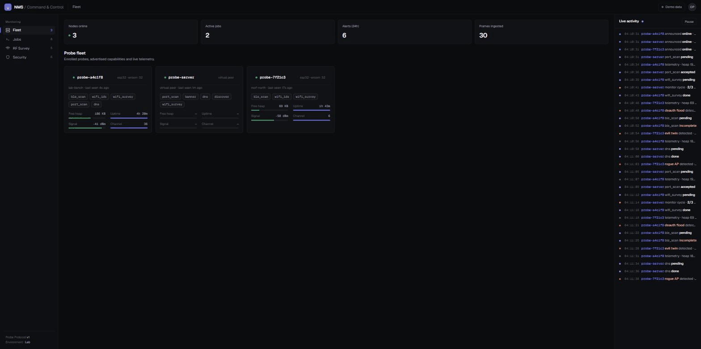
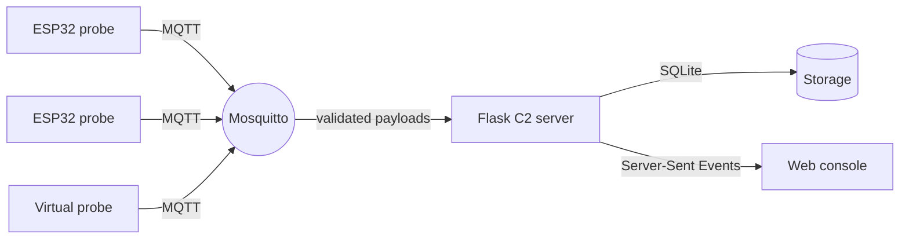
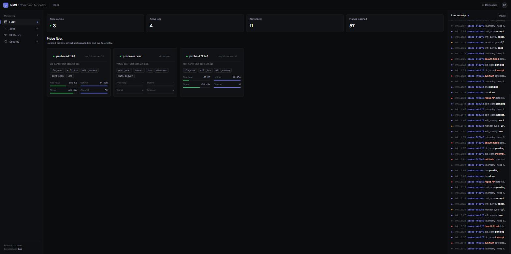
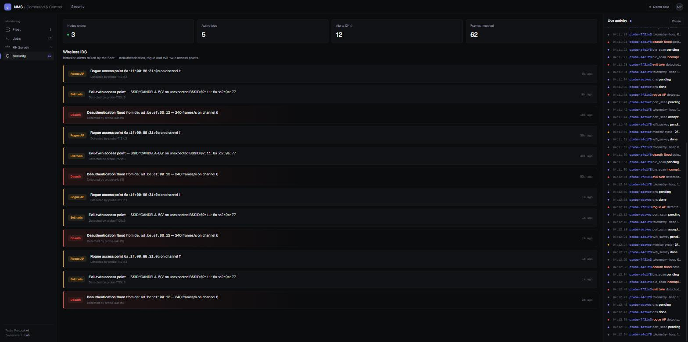
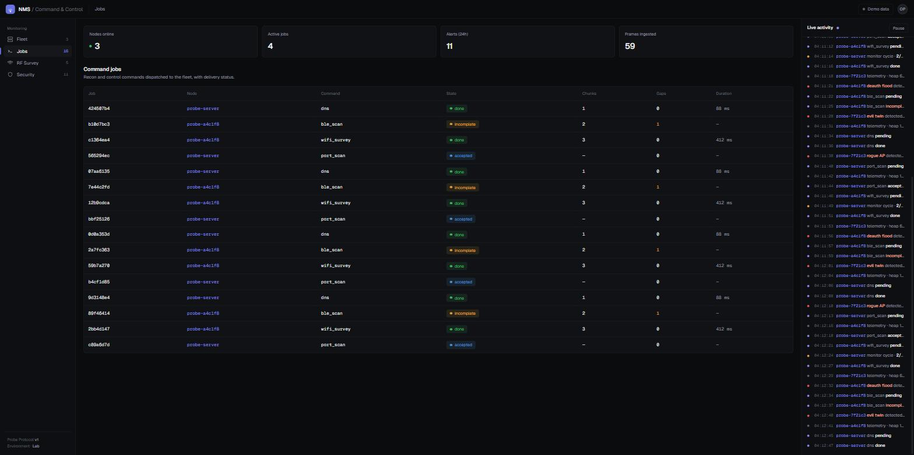
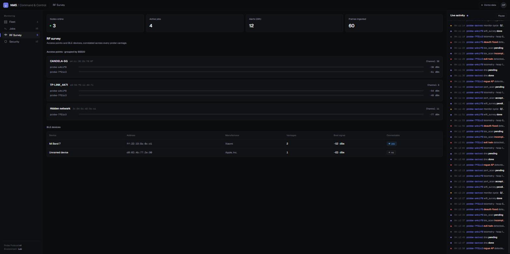

# NMS — Distributed Wireless-Security Monitoring

**ESP32 probes and a Python command-and-control server speaking a formally-specified MQTT
protocol, with a live web console and a wireless intrusion-detection system.** Built for
security research on isolated lab networks.




A fleet of distributed probes watches the wireless environment and reports over MQTT to a
central server, which stores results, detects intrusions, and streams everything live to an
operations console. The probes run on ESP32 hardware; a Python "virtual probe" is a
first-class protocol peer, so the whole system runs and is demoable with no hardware.

## Architecture



## Highlights

- **Wireless intrusion detection** — deauthentication-flood, rogue-AP and evil-twin
  detection, surfaced as a live alert timeline. See [`docs/SECURITY.md`](docs/SECURITY.md).
- **Multi-vantage RF survey** — access points correlated by BSSID across every probe, with
  per-probe signal strength.
- **A formally-specified protocol** — a JSON-Schema contract with a golden-fixture corpus and
  a conformance suite that runs against both the reference implementation and firmware.
- **Live operations console** — a real-time dashboard over one Server-Sent-Events stream.

## Screenshots

| Fleet | Security |
| --- | --- |
|  |  |

| Jobs | RF Survey |
| --- | --- |
|  |  |

## Quickstart

```bash
pip install -r requirements-dev.txt
python scripts/run_all.py     # broker + server + virtual probe, one command
```

Then open the console at `http://127.0.0.1:5000/`.

Run the tests:

```bash
python -m pytest tests/ -q
```

## Project structure

- `protocol/` — the Probe Protocol v1 contract: JSON Schemas, golden fixtures, topics.
- `server/` + `probe/` — the C2 server (MQTT bridge, SQLite storage, REST + SSE API) and the
  virtual probe, a real protocol peer.
- `firmware/` — ESP32 (WROOM-32) probe firmware: radio state machine, wifi_ids, ble_scan.
- `templates/` — the web operations console.

Design specs live in [`docs/design/`](docs/design/); the system overview is in
[`ARCHITECTURE.md`](ARCHITECTURE.md).

## Security & ethics

This is security-research tooling for **isolated lab networks owned by the author**. Detection
(`wifi_ids`) is passive and always on. The firmware also implements `wifi_deauth`, a
C2-dispatched 802.11 deauthentication capability — it only runs when the server publishes a
job, and the job args require an explicit `confirm: true`. Full threat model and responsible-use
statement: [`docs/SECURITY.md`](docs/SECURITY.md).

## License

MIT — see [`LICENSE`](LICENSE). Third-party attribution (and a record of which
techniques were adopted and which were deliberately not) in [`firmware/NOTICE`](firmware/NOTICE).
